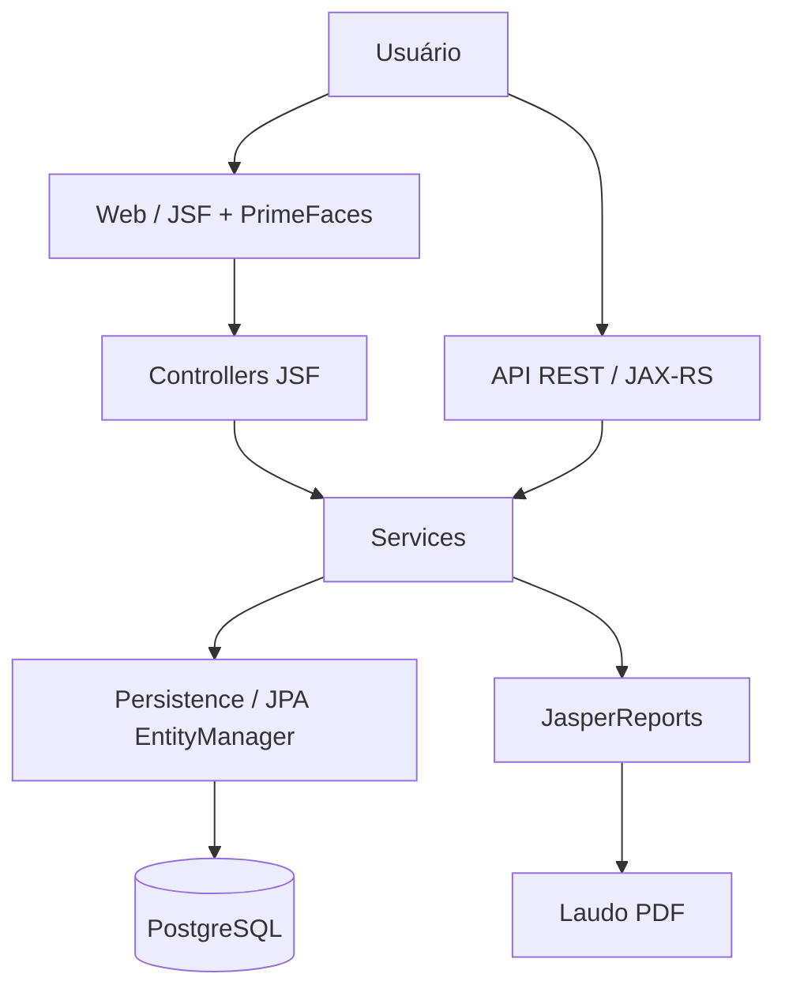
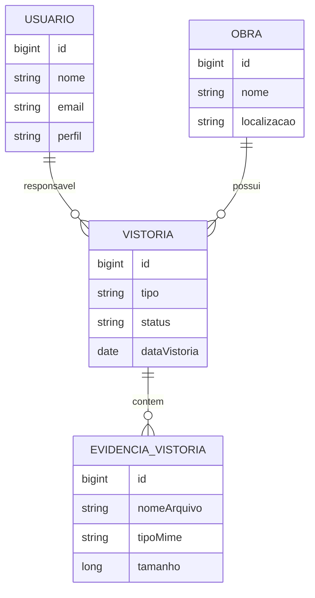

# ObraSync

[](https://github.com/joao-juvino/ObraSync/actions/workflows/ci.yml)


Aplicação web para registrar, acompanhar e consultar vistorias de obras, desenvolvida como projeto de portfólio com foco em backend Java e Jakarta EE.

## Sobre o projeto

O ObraSync organiza informações de obras, usuários e vistorias em um único sistema. Ele atende ao cenário de equipes de engenharia, fiscalização e administração que precisam registrar inspeções, acompanhar seus status e emitir laudos.

O objetivo do projeto é demonstrar uma aplicação corporativa em Java: interface web server-side, API REST, persistência relacional, autenticação, relatórios e automação de qualidade em um ambiente compatível com WildFly.

## Funcionalidades

- Cadastro, consulta, edição e exclusão de obras, usuários e vistorias na camada de serviços.
- Interface JSF/PrimeFaces para gerenciamento de vistorias, com formulário responsivo, indicadores e tabela paginada.
- Associação de cada vistoria a uma obra e a um usuário responsável.
- Filtros de vistorias por status, tipo, obra, responsável e intervalo de datas.
- API REST para CRUD de vistorias, filtros, paginação e resumo de indicadores.
- Autenticação REST baseada em JWT e controle de acesso por perfis `ADMIN`, `ENGENHEIRO` e `FISCAL`.
- Proteção de páginas JSF por sessão e filtro de autorização.
- Geração de laudos em PDF com JasperReports.
- Versionamento do schema PostgreSQL com Flyway.
- Modelagem de evidências fotográficas: metadados vinculados à vistoria e serviço de armazenamento local configurável. O upload e a consulta dessas evidências ainda não estão expostos pela API ou pela tela JSF.
- Testes unitários e de recursos REST com JUnit 5 e Mockito, além de relatório de cobertura JaCoCo.

## Tecnologias

| Tecnologia | Uso no projeto |
| --- | --- |
| Java 11 | Linguagem principal da aplicação. |
| Jakarta EE 8 | Base da aplicação corporativa e integrações com o servidor. |
| JPA | Mapeamento e acesso aos dados por `EntityManager`. |
| JSF | Camada web server-side. |
| PrimeFaces e PrimeFlex | Componentes de interface e layout responsivo. |
| JAX-RS | Implementação da API REST. |
| MicroProfile OpenAPI | Anotações e configuração da especificação OpenAPI. |
| PostgreSQL | Banco de dados relacional. |
| Flyway | Migrations versionadas do banco. |
| WildFly | Servidor de aplicação alvo. |
| Maven | Build, dependências, testes e empacotamento WAR. |
| Docker e Docker Compose | Inicialização dos containers de PostgreSQL e WildFly. |
| JasperReports | Geração dos laudos de vistoria em PDF. |
| JUnit 5 e Mockito | Testes unitários e de recursos. |
| JaCoCo | Geração do relatório HTML de cobertura. |
| JJWT e jBCrypt | Emissão de JWT e hash de senhas. |
| GitHub Actions | Integração contínua em pushes para `main` e pull requests. |

## Arquitetura

O projeto separa responsabilidades entre interface web, controladores JSF, API REST, regras de negócio e persistência JPA. Relatórios são produzidos a partir da camada de serviços com JasperReports.



Principais camadas:

- **Web / JSF:** páginas XHTML e componentes PrimeFaces para a experiência web.
- **Controller:** beans JSF que coordenam ações da tela e conversam com os serviços.
- **REST:** recursos JAX-RS, DTOs, filtros e respostas HTTP da API.
- **Service:** regras de negócio, CRUD, filtros, métricas e integração com relatórios.
- **Persistence / JPA:** entidades e consultas JPQL usando `EntityManager` injetado.
- **PostgreSQL:** armazenamento persistente criado e evoluído por migrations Flyway.
- **Reports:** serviço e template JasperReports para geração de laudos.

## Modelo de domínio

- **Usuario:** representa quem acessa ou é responsável por uma vistoria; possui e-mail, senha armazenada como hash e perfil de autorização.
- **Obra:** representa a obra acompanhada, com nome, localização, descrição e período planejado.
- **Vistoria:** representa a inspeção, incluindo tipo, status, data, observações, obra e responsável.
- **EvidenciaVistoria:** representa o metadado de um arquivo de evidência associado a uma vistoria, incluindo tipo MIME, tamanho, identificador seguro e data de upload.



## API REST

A API está disponível sob o prefixo `/api`. Os recursos de vistoria exigem token JWT no cabeçalho `Authorization: Bearer <token>`.

| Método | Endpoint | Descrição |
| --- | --- | --- |
| `POST` | `/api/auth/login` | Autentica o usuário e retorna um token JWT. |
| `GET` | `/api/vistorias` | Lista vistorias com filtros e paginação. |
| `GET` | `/api/vistorias/{id}` | Busca uma vistoria pelo identificador. |
| `POST` | `/api/vistorias` | Cria uma vistoria. |
| `PUT` | `/api/vistorias/{id}` | Atualiza integralmente uma vistoria. |
| `PATCH` | `/api/vistorias/{id}` | Atualiza parcialmente os campos enviados. |
| `DELETE` | `/api/vistorias/{id}` | Exclui uma vistoria. |
| `GET` | `/api/vistorias/resumo` | Retorna totalizadores e taxa de aprovação. |

Filtros disponíveis em `GET /api/vistorias`: `status`, `tipo`, `obra`, `responsavel`, `dataInicial`, `dataFinal`, `page` e `size`.

Exemplo de consulta:

```http
GET /api/vistorias?status=PENDENTE&page=0&size=20
Authorization: Bearer <token>
```

Exemplo de criação:

```http
POST /api/vistorias
Content-Type: application/json
Authorization: Bearer <token>

{
  "tipo": "SEGURANCA_TRABALHO",
  "status": "PENDENTE",
  "dataVistoria": "2026-09-17",
  "observacoes": "Verificar sinalização da área.",
  "obraId": 1,
  "responsavelId": 2
}
```

A especificação é disponibilizada pelo suporte OpenAPI do WildFly quando o subsistema MicroProfile OpenAPI estiver habilitado, normalmente em `/openapi`. O projeto não inclui Swagger UI empacotada.

## Como executar

### Pré-requisitos

- Git
- Java 11
- Maven 3.8 ou superior
- Docker e Docker Compose
- WildFly configurado com o driver PostgreSQL e o datasource JNDI `java:jboss/datasources/PostgresDS`

Clone e gere o WAR:

```bash
git clone https://github.com/joao-juvino/ObraSync.git
cd ObraSync
mvn clean package
```

Inicie os containers definidos no projeto:

```bash
docker compose up
```

O `docker-compose.yml` inicia PostgreSQL e WildFly e monta o WAR gerado em `target/obrasync.war`. Como o `persistence.xml` usa o datasource JNDI `PostgresDS`, o WildFly também precisa ter o driver e esse datasource configurados para que a aplicação se conecte ao banco.

## Banco de dados

O PostgreSQL armazena usuários, obras, vistorias e evidências. A criação e evolução do schema são versionadas em `src/main/resources/db/migration`:

- `V1` cria as tabelas e a estrutura inicial.
- `V2` insere dados demonstrativos.
- `V3`, `V4` e `V5` ajustam tipos, índices e perfis.
- `V6` cria a tabela de evidências de vistoria.

O JPA está configurado com `jakarta.persistence.schema-generation.database.action=validate`: ele valida o schema existente, sem recriá-lo automaticamente. Assim, a evolução estrutural fica sob responsabilidade do Flyway.

## Testes

Execute a suíte de testes com:

```bash
mvn test
```

Para executar os testes e gerar o relatório JaCoCo:

```bash
mvn verify
```

O relatório HTML é gerado em `target/site/jacoco/index.html`. A automação do GitHub Actions também executa `mvn clean test` e `mvn package` em pushes para `main` e pull requests.

## Relatórios

O `RelatorioService` utiliza JasperReports e o template `src/main/resources/relatorios/laudo-vistoria.jrxml` para gerar laudos de vistoria em PDF. O relatório apresenta os dados disponíveis da vistoria, da obra e do responsável.

## Screenshots

Inclua capturas das telas reais nestes caminhos quando elas estiverem disponíveis:

- `docs/screenshots/dashboard.png` — indicadores e visão geral.
- `docs/screenshots/vistorias.png` — listagem e formulário de vistorias.
- `docs/screenshots/laudo.png` — exemplo de laudo gerado.

## Decisões técnicas

- A aplicação preserva Jakarta EE e WildFly, sem migrar para Spring Boot.
- A persistência usa JPA e consultas no banco para filtros e paginação, evitando carregar todas as vistorias em memória.
- O banco é evoluído por Flyway, enquanto o JPA apenas valida o schema.
- Senhas são transformadas em hash BCrypt e não são expostas na serialização JSON da entidade de usuário.
- Evidências são planejadas para armazenamento de arquivos local configurável por `OBRASYNC_UPLOAD_DIR`; apenas seus metadados pertencem ao banco. O serviço aceita JPEG e PNG, impõe limite de 10 MB e gera nomes internos seguros.

## Melhorias futuras

- Expor upload, consulta e exclusão de evidências pela API REST e pela interface JSF.
- Incluir evidências fotográficas nos laudos JasperReports.
- Externalizar o segredo de assinatura JWT por configuração segura de ambiente.
- Disponibilizar Swagger UI junto da especificação OpenAPI.
- Automatizar a configuração do datasource PostgreSQL no ambiente WildFly via container.

## Autor

[João Pedro Juvino](https://github.com/joao-juvino)
