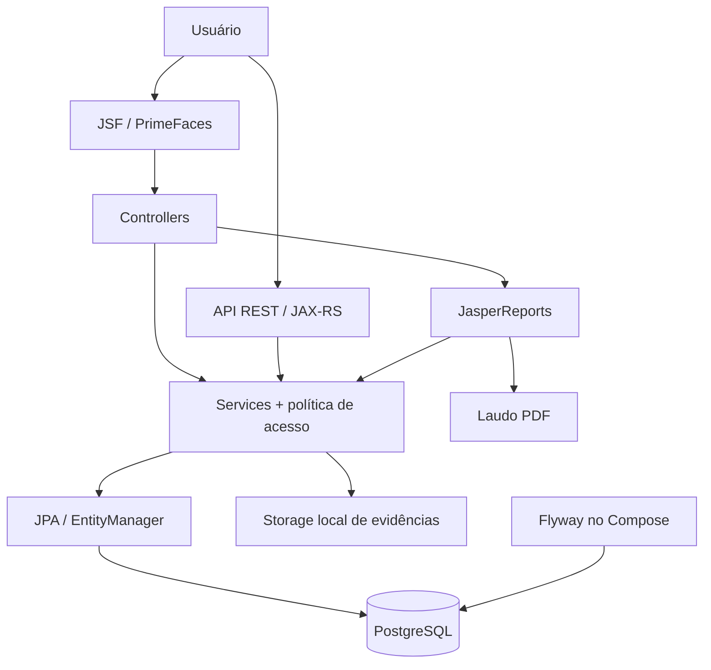
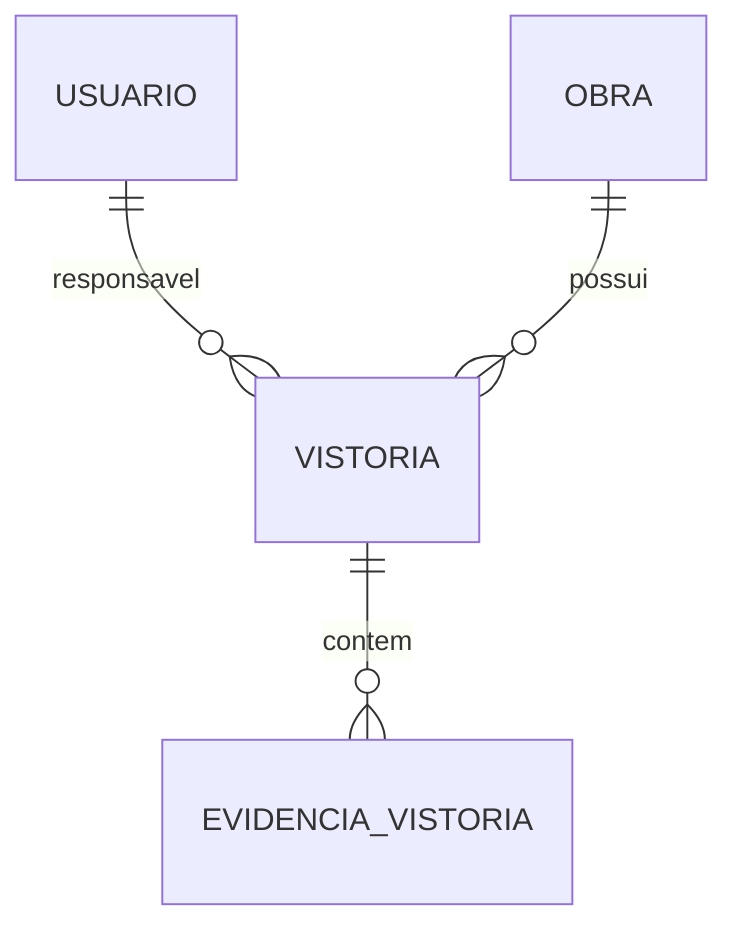

# ObraSync

[](https://github.com/joao-juvino/ObraSync/actions/workflows/ci.yml)


Sistema de gestão e vistoria de obras. Projeto de portfólio voltado ao desenvolvimento backend Java e Jakarta EE, com interface JSF, API REST e persistência PostgreSQL.

## Preview

A demonstração concentra indicadores, tabela de vistorias, formulários, galeria de evidências e emissão de laudos. As capturas reais estão previstas na seção [Screenshots](#screenshots); nenhuma imagem ilustrativa é apresentada como tela do sistema.

O registro de validação da versão está em [docs/FINALIZATION.md](docs/FINALIZATION.md). A execução dos containers precisa ser confirmada em um ambiente com Docker.

## Sobre o projeto

ObraSync reúne registros de inspeções associados a obras e responsáveis técnicos. O sistema demonstra uma aplicação Java corporativa de arquitetura monolítica, com transações JPA, controle de acesso no servidor, relatórios e testes automatizados.

## Problema

Equipes de engenharia e fiscalização precisam consultar o histórico de inspeções, identificar pendências e reunir fotografias e informações técnicas em um laudo. O projeto modela esse fluxo em uma aplicação única, adequada à demonstração em entrevistas.

## Funcionalidades

- Login web por sessão e autenticação REST por JWT.
- Perfis ADMIN, ENGENHEIRO e FISCAL com permissões verificadas nos serviços.
- Cadastro, consulta, edição e exclusão de vistorias, vinculadas a obra e responsável.
- Indicadores por status e taxa de aprovação.
- Filtros REST por status, tipo, nome da obra, nome do responsável e intervalo de datas; paginação no PostgreSQL.
- Tabela JSF com filtros, ordenação, paginação e adaptação básica para celular.
- Upload, listagem, visualização e remoção de evidências JPEG/PNG na API e na tela.
- Laudo PDF com informações da vistoria e páginas de evidências.
- Serviços JPA para obras e usuários; esses cadastros não possuem telas ou recursos REST administrativos próprios na v1.0.
- Migrations, contrato OpenAPI, Swagger UI e pipeline de validação.

## Arquitetura



Os controllers coordenam a interface; recursos REST recebem DTOs; services aplicam regras e operações transacionais. O container WildFly injeta o EntityManager e administra as transações. Os binários ficam em volume local, enquanto os metadados ficam no banco.

## Tecnologias

| Tecnologia | Responsabilidade |
| --- | --- |
| Java 11 / Jakarta EE 8 | Linguagem e APIs corporativas; a versão EE 8 utiliza pacotes `javax.*`. |
| JSF / PrimeFaces 12 / PrimeFlex 3 | Interface server-side, componentes e layout responsivo. |
| JAX-RS / JSON-B | API HTTP e DTOs JSON. |
| JPA / PostgreSQL 15 | Persistência e consultas parametrizadas. |
| WildFly 24 | Servidor de aplicação, datasource, transações e MicroProfile OpenAPI. |
| Flyway 9 | Evolução versionada do schema antes do deploy. |
| Maven / Docker Compose | Build WAR e composição do ambiente local. |
| JasperReports / OpenPDF | Laudos PDF, incluindo imagens. |
| JJWT / BCrypt | Tokens assinados e hash de senhas. |
| JUnit 5 / Mockito / JaCoCo | Testes e limite mínimo de cobertura. |
| GitHub Actions | Build, testes, cobertura e construção da imagem. |

## Modelo de domínio

- **Usuario:** nome, e-mail, hash de senha e perfil.
- **Obra:** nome, endereço, início e previsão de conclusão.
- **Vistoria:** obra, responsável, tipo, data, status, localização e observações.
- **EvidenciaVistoria:** metadados da imagem, descrição, tamanho, MIME, identificador interno e data de upload.



As tabelas são `tb_usuario`, `tb_obra`, `tb_vistoria` e `tb_evidencia_vistoria`. Foreign keys e constraints preservam os relacionamentos.

## Segurança

O login REST verifica BCrypt e emite JWT válido por oito horas. Envie-o em `Authorization: Bearer <token>`. A assinatura usa `OBRASYNC_JWT_SECRET`, com no mínimo 32 bytes; a ausência impede a inicialização do serviço. O perfil é consultado no banco a cada requisição autenticada.

O login JSF usa sessão HTTP, troca seu identificador após autenticar e invalida a sessão no logout. As páginas e imagens JSF exigem sessão. As operações de escrita passam pela mesma política de autorização usada na API:

| Ação | ADMIN | ENGENHEIRO | FISCAL |
| --- | --- | --- | --- |
| Fila exibida no painel JSF | Todas | Somente as próprias | Todas para fiscalização |
| Consultar fotos e laudos da fila visível | Sim | Sim | Sim |
| Criar vistoria | Sim | Como responsável | Não |
| Editar dados e status de vistoria | Sim | Somente as próprias | Somente status |
| Enviar/remover evidências | Sim | Somente nas próprias | Não |
| Excluir vistoria | Sim | Não | Não |
| Escrita nos serviços de obras/usuários | Sim | Não | Não |

A API retorna 401 para autenticação inválida e 403 para falta de permissão. DTOs não retornam senhas; o getter da senha da entidade também é excluído de JSON-B. Erros técnicos são substituídos por mensagens públicas.

Os seeds contêm contas públicas de demonstração. As configurações do exemplo são somente locais. Segredos encontrados no histórico foram registrados na auditoria; o histórico não foi reescrito.

## API REST

Base local: `http://localhost:8080/obrasync/api`.

| Método | Caminho | Resultado |
| --- | --- | --- |
| POST | `/auth/login` | Token JWT |
| GET | `/vistorias` | Página filtrada |
| GET | `/vistorias/{id}` | Vistoria |
| POST | `/vistorias` | Criação: 201 e Location |
| PUT | `/vistorias/{id}` | Atualização: 200 |
| PATCH | `/vistorias/{id}/status` | Alteração de status por ADMIN/FISCAL |
| DELETE | `/vistorias/{id}` | Exclusão: 204 |
| GET | `/vistorias/resumo` | Total, aprovadas, pendentes, reprovadas, em andamento e taxa de aprovação |
| POST / GET | `/vistorias/{id}/evidencias` | Envio de imagem / listagem de metadados |
| GET / DELETE | `/vistorias/{id}/evidencias/{evidenciaId}` | Leitura da imagem / exclusão |

Exemplo de login com conta demonstrativa:

```http
POST /obrasync/api/auth/login
Content-Type: application/json

{"email":"admin@obrasync.com","senha":"admin123"}
```

Criação de vistoria (IDs válidos dos seeds em banco novo):

```json
{
  "obraId": 1,
  "responsavelId": 2,
  "tipo": "ELETRICA",
  "status": "PENDENTE",
  "dataVistoria": "2026-09-23",
  "localizacao": "Bloco A",
  "observacoes": "Inspeção das instalações."
}
```

Filtros aceitos: `status`, `tipo`, `obra`, `responsavel`, `dataInicial`, `dataFinal`, `page` e `size`. Datas são inclusivas, no formato `yyyy-MM-dd`; nomes usam busca parcial. Página inicial: 0. Tamanho padrão: 20, máximo: 100.

```http
GET /obrasync/api/vistorias?status=PENDENTE&page=0&size=20
Authorization: Bearer <token>
```

Respostas de erro têm `status`, `mensagem` e `timestamp`. Conforme o caso, a API utiliza 400, 401, 403, 404, 409, 413 ou 415. Não há PATCH genérico de vistoria: a rota parcial é específica para status.

## Evidências

Na tela de vistorias, use o botão de imagens para abrir a galeria. O envio aceita JPEG e PNG de até 10 MB e 20 megapixels, conferindo o conteúdo real e o MIME. Na API, envie o arquivo como corpo binário, sem multipart:

```bash
curl -X POST "http://localhost:8080/obrasync/api/vistorias/1/evidencias?nome=foto.png" \
  -H "Authorization: Bearer <token>" \
  -H "Content-Type: image/png" \
  --data-binary "@foto.png"
```

`OBRASYNC_UPLOAD_DIR` define a raiz do storage; no Compose é `/opt/jboss/uploads`, persistida no volume `evidencias`. Fora do Compose, o padrão é uma pasta `obrasync-evidencias` no diretório temporário do Java.

Nomes UUID são gerados no servidor. O nome original é apenas metadado; não é usado para resolver caminhos. Há proteção contra traversal e links simbólicos no arquivo. A leitura verifica se a evidência pertence à vistoria solicitada.

Envios são compensados em rollback. Exclusões movem o arquivo para uma área temporária no mesmo diretório, restauram em rollback e removem após commit. Banco e arquivos devem ser preservados juntos nos backups.

## Relatórios

O botão de PDF da tabela gera o laudo com JasperReports. O template principal fica em `src/main/resources/reports/laudo_vistoria.jrxml`; `evidencias.jrxml` gera as páginas de fotografias.

Vistorias sem fotos continuam gerando laudo. Arquivos ausentes ou inválidos recebem uma indicação no anexo, sem impedir a emissão do restante do documento.

## Quick Start

Pré-requisitos: Git, Docker com suporte a containers Linux e Docker Compose v2. Java e Maven locais não são necessários para o fluxo Docker.

```bash
git clone https://github.com/joao-juvino/ObraSync.git
cd ObraSync
cp .env.example .env
docker compose up --build
```

No PowerShell, o comando de cópia equivalente é `Copy-Item .env.example .env`. Não sobrescreva um `.env` já configurado.

O Dockerfile multi-stage compila e testa com Java 11, copia o driver PostgreSQL e o WAR, e configura o datasource `java:jboss/datasources/PostgresDS`. Não há montagem de `target/obrasync.war` nem configuração manual do WildFly.

A sequência do Compose é PostgreSQL saudável → Flyway concluído → WildFly → deploy do WAR. A porta publicada é `127.0.0.1:8080`; banco e administração do WildFly ficam sem portas publicadas.

Após o deploy, acesse:

- Interface: [localhost:8080/obrasync/](http://localhost:8080/obrasync/).
- Login: [localhost:8080/obrasync/login.xhtml](http://localhost:8080/obrasync/login.xhtml).
- Swagger: [localhost:8080/obrasync/api-docs/](http://localhost:8080/obrasync/api-docs/).

Contas exclusivamente demonstrativas, todas com senha `admin123`:

| Perfil | E-mail |
| --- | --- |
| ADMIN | `admin@obrasync.com` |
| ENGENHEIRO | `joao.silva@obrasync.com` |
| FISCAL | `fiscal@obrasync.com` |

Para inspecionar a inicialização:

```bash
docker compose ps -a
docker compose logs flyway_obrasync wildfly_obrasync
```

`docker compose down` encerra os containers e mantém os volumes. Se reutilizar um volume PostgreSQL de uma execução anterior, mantenha no `.env` as credenciais originalmente usadas: mudar as variáveis não troca a senha de um banco já inicializado.

Para desenvolvimento sem Docker, use Java 11 e Maven, gere o WAR com `mvn clean package` e forneça a mesma infraestrutura de datasource e migrations do Compose.

## Banco de dados

Flyway tem uma única responsabilidade: aplicar migrations pelo serviço dedicado do Compose antes da aplicação. O WAR não executa um segundo migrador.

As migrations V1–V8 criam schema e seeds, alinham enums e datas, adicionam índices, o perfil FISCAL e evidências, corrigem hashes demonstrativos e alinham o tipo da coluna de senha. Scripts já aplicados foram preservados.

Hibernate usa `hibernate.hbm2ddl.auto=validate`: verifica a compatibilidade do schema e não cria tabelas. O volume `pgdata` mantém os dados entre reinicializações.

## Swagger / OpenAPI

O perfil `standalone-microprofile.xml` do WildFly habilita MicroProfile OpenAPI. A especificação da aplicação é servida em [localhost:8080/openapi](http://localhost:8080/openapi).

Swagger UI consome esse endpoint em `/obrasync/api-docs/`. Seus assets são carregados de CDN com versão fixa; é necessária conexão à internet. O contrato em `META-INF/openapi.json` complementa as anotações, e um teste compara os caminhos e métodos documentados com os recursos JAX-RS reais.

Para testar, execute o login, copie o campo `token` e use **Authorize** no Swagger.

## Testes

Com Java 11 e Maven:

```bash
mvn clean verify
```

O comando compila, executa os testes, gera `target/obrasync.war`, produz o relatório de cobertura e verifica o limite mínimo.

A suíte cobre persistência com EntityManager simulado, filtros e paginação, BCrypt, JWT, RBAC, sessão JSF, recursos REST, arquivos de evidência, compensação transacional e PDFs reais. Testes unitários não exigem PostgreSQL, credenciais reais ou Docker; não substituem a validação integrada do ambiente.

## Cobertura

JaCoCo exige no mínimo **70% de cobertura de linhas** no código considerado. O build falha abaixo desse valor. Relatório HTML: `target/site/jacoco/index.html`.

DTOs triviais, entidades simples, a classe de resultado de paginação e configuração declarativa da API são excluídos. Services, segurança, controllers, recursos REST e relatórios permanecem no escopo. O resultado da última execução está registrado em [FINALIZATION.md](docs/FINALIZATION.md).

## CI/CD

GitHub Actions executa em pushes para `main` e pull requests:

1. Checkout e configuração do Java 11 com cache Maven.
2. `mvn clean verify`, incluindo limite de cobertura.
3. Verificação do WAR gerado.
4. Build da imagem Docker.

Não há deploy, publicação, commit ou criação de tags automáticos.

## Estrutura principal

```text
.github/workflows/       Integração contínua
docker/wildfly/          Imagem e configuração do datasource
docs/                   Auditoria e instruções de screenshots
src/main/java/com/obrasync/
  controller/           Beans JSF e leitura autenticada de imagens
  converter/            Conversores de entidades para JSF
  filter/               Proteção de páginas por sessão
  model/                Entidades e enums
  report/               Geração de laudos
  rest/                 Recursos HTTP e DTOs
  security/             JWT e política de acesso
  service/              Regras, persistência e storage
src/main/resources/
  db/migration/         Migrations Flyway
  META-INF/             JPA e OpenAPI
  reports/              Templates JasperReports
src/main/webapp/        JSF, CSS e Swagger UI
src/test/               Testes automatizados
```

## Decisões técnicas

- Manter Jakarta EE e WildFly para demonstrar serviços gerenciados, injeção e transações.
- Usar Flyway antes do deploy para ter ordem determinística entre schema e validação JPA.
- Usar DTOs REST para separar contratos HTTP das entidades e evitar expor senhas ou coleções JPA.
- Carregar obra e responsável com JOIN FETCH nas consultas de vistorias.
- Manter arquivos fora do banco, com compensação ligada ao resultado da transação.
- Compartilhar a política de autorização entre JSF e REST.
- Manter armazenamento local e monólito, suficientes para o escopo da demonstração.

## Screenshots

Arquivos a capturar manualmente; ainda não existem imagens publicadas:

| Arquivo | Tela/estado |
| --- | --- |
| `docs/screenshots/login.png` | Login sem dados sensíveis |
| `docs/screenshots/dashboard.png` | Indicadores no topo da página de vistorias |
| `docs/screenshots/vistorias.png` | Tabela com filtros, status e ações |
| `docs/screenshots/evidencias.png` | Galeria aberta após upload |
| `docs/screenshots/laudo.png` | PDF com dados e evidências |

Orientações em [docs/screenshots/README.md](docs/screenshots/README.md).

## Limitações conhecidas

- Ambiente demonstrativo local, com contas públicas de seed e HTTP em localhost; não é apresentado como pronto para produção.
- Storage local de instância única. Uma interrupção abrupta entre banco e filesystem pode exigir reconciliação manual de arquivos temporários; a compensação cobre rollback normal, não oferece transação distribuída.
- PrimeFlex e Swagger UI dependem de CDN.
- A tabela JSF pagina a lista carregada; a API aplica paginação no banco.
- As capturas e a execução integrada em Docker ainda dependem da validação indicada em FINALIZATION.md.

## Autor

[João Pedro Juvino](https://github.com/joao-juvino)
